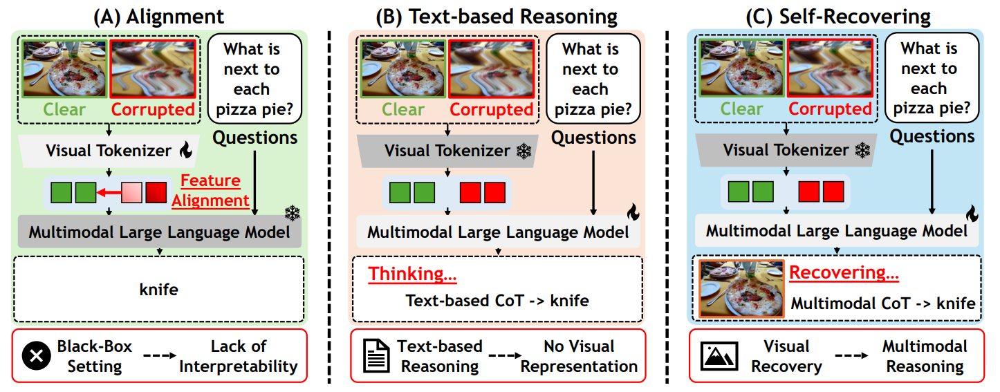
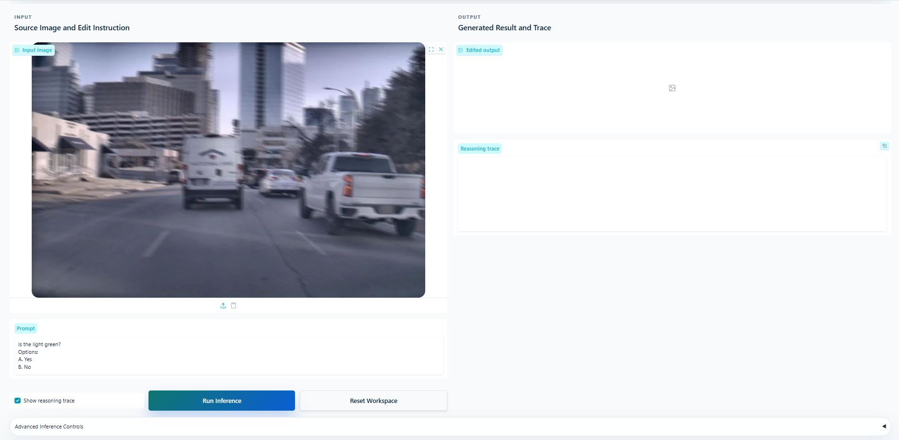

<div align="center">

# Robust-U1: Can MLLMs Self-Recover Corrupted Visual Content for Robust Understanding?

<p><b>ICML 2026</b> &nbsp;|&nbsp; Official Implementation</p>

[Jiaqi Tang](https://jqt.me/)<sup>★</sup>,
[Jianmin Chen](https://github.com/Ch921-cell)<sup>★</sup>,
[Youyang Zhai]()<sup>★</sup>,
[Wei Wei](https://scholar.google.com/citations?hl=zh-CN&user=v8KMYlwAAAAJ)<sup>‡</sup>,
[Runtao Liu](),
[Mengjie Zhao](),
[Xiangyu Wu](),
[Qingfa Xiao](),

[Qifeng Chen](https://cqf.io)<sup>†</sup>

<sub><sup>★</sup> Equal contribution &nbsp;&nbsp; <sup>†</sup> Corresponding author &nbsp;&nbsp; <sup>‡</sup> Co-corresponding author</sub>

<br/>

[](https://openreview.net/forum?id=I6W6cxVVts)
[](https://arxiv.org/abs/2606.08063)
[](https://huggingface.co/Jiaqi-hkust/Robust-U1)
[](https://huggingface.co/spaces/Jiaqi-hkust/Robust-U1)
[](https://opensource.org/licenses/MIT)
[](https://github.com/jqtangust/Robust-U1)

</div>

> **TL;DR** — *Robust-U1* is a unified MLLM that **self-recovers corrupted visual content** and reasons over it, enabling **robust visual understanding** under real-world image degradations.

---

## 📰 News

- **`2026-06-11`** 🔥 We release the **code**, **pretrained models**, and the **online demo** of *Robust-U1*!
- **`2026-05-07`** 🎉 *Robust-U1* is accepted to **ICML 2026**!

---

## 📑 Table of Contents

[🔭 Motivation](#-motivation) &nbsp;·&nbsp; [📦 Installation](#-installation) &nbsp;·&nbsp; [🤖 Models](#-models) &nbsp;·&nbsp; [💻 Demo](#-demo) &nbsp;·&nbsp; [🧠 Training](#-training) &nbsp;·&nbsp; [📊 Evaluation](#-evaluation) &nbsp;·&nbsp; [⭐ Citation](#-citation) &nbsp;·&nbsp; [📬 Contact](#-contact)

---

## 🔭 Motivation

Existing approaches to robust visual understanding face two key limitations:

- 🚩 **Black-Box Alignment** — Feature-alignment methods lack interpretability and fail to explicitly model the corruption process.
- 🚩 **Text-Only Compensation** — Text-based reasoning cannot recover lost pixel-level visual details for faithful visual understanding.

> This motivates a key question: ***Can MLLMs recover corrupted visual content by themselves?***

<div align="center">
  
</div>

---

## 📦 Installation

**1. Clone the repository**

```bash
git clone https://github.com/jqtangust/Robust-U1.git
cd Robust-U1
```

**2. Create the environment**

```bash
conda create -n Robust-U1 python=3.10
conda activate Robust-U1
pip install -r requirements.txt
pip install -e .
```

---

## 🤖 Models

| Model | Link | Description |
|:------|:-----|:------------|
| BAGEL-7B-MoT | [ByteDance-Seed/BAGEL-7B-MoT](https://huggingface.co/ByteDance-Seed/BAGEL-7B-MoT) | Base model used as the initial weights for training. |
| **Robust-U1** | [Jiaqi-hkust/Robust-U1](https://huggingface.co/Jiaqi-hkust/Robust-U1) | Final model for visual self-recovery and multimodal reasoning. |
| **Robust-U1-SFT** | [Jiaqi-hkust/Robust-U1-SFT](https://huggingface.co/Jiaqi-hkust/Robust-U1-SFT) | Stage-I supervised fine-tuned checkpoint. |
| **Robust-U1-RL** | [Jiaqi-hkust/Robust-U1-RL](https://huggingface.co/Jiaqi-hkust/Robust-U1-RL) | Stage-II reinforcement-learning checkpoint. |

---

## 💻 Demo

> 🌐 **Online demo** — try *Robust-U1* directly on [Hugging Face Spaces](https://huggingface.co/spaces/Jiaqi-hkust/Robust-U1).

### 🖥️ CLI

Run the command-line demo with a local model path and an output directory for recovered images:

```bash
export MODEL_PATH="/path/to/Robust-U1"
export OUTPUT_DIR="./outputs"

python demo.py \
  --model-path "$MODEL_PATH" \
  --output-dir "$OUTPUT_DIR"
```

### 🪟 GUI

Set the model path and start the local Gradio demo (available at `http://localhost:7860` by default):

```bash
export MODEL_PATH="/path/to/Robust-U1"
python app.py --model-path "$MODEL_PATH"
```

<div align="center">
  
</div>

---

## 🧠 Training

*Robust-U1* is trained with a **three-stage pipeline**:

| Stage | Goal | Framework |
|:-----:|:-----|:----------|
| **I. Visual Self-Recovery** | Recover clean images from corrupted inputs (SFT) | [MathCanvas](https://github.com/shiwk24/MathCanvas/) |
| **II. Visual Quality Alignment** | Align recovery with pixel-level fidelity & semantics (RL) | [Flow-GRPO](https://github.com/yifan123/flow_grpo) |
| **III. Multimodal Reasoning** | Reason over corrupted & recovered images | [MathCanvas](https://github.com/shiwk24/MathCanvas/) |

### 🎓 Stage I & III — Self-Recovery & Reasoning

We use [MathCanvas](https://github.com/shiwk24/MathCanvas/) for both supervised fine-tuning and multimodal reasoning training. Stage I adapts the base unified MLLM to recover clean images from corrupted inputs, while Stage III trains the model to reason over both corrupted and recovered images.

1. Prepare the MathCanvas training framework:

   ```bash
   git clone https://github.com/shiwk24/MathCanvas.git
   cd MathCanvas/BAGEL-Canvas
   ```

2. Download the base model [BAGEL-7B-MoT](https://huggingface.co/ByteDance-Seed/BAGEL-7B-MoT).

3. Prepare the training data:

   * For Stage I, prepare paired corrupted-clean image data for visual self-recovery.
   * For Stage III, prepare reasoning data with corrupted images, recovered images, questions, and reasoning-chain annotations.

4. Modify the dataset paths in `data/dataset_info.py` and configure the corresponding training scripts with your local paths.

5. Run Stage-I supervised fine-tuning to obtain the SFT checkpoint:

   ```bash
   bash scripts/train/stage1.sh
   ```

6. After Stage-II reinforcement learning, run Stage-III multimodal reasoning training:

   ```bash
   bash scripts/train/stage2.sh
   ```

### 🎓 Stage II — Visual Quality Alignment (RL)

We use [Flow-GRPO](https://github.com/yifan123/flow_grpo) to further align the recovery model with pixel-level structural fidelity and semantic consistency. The Robust-U1 rewards are packaged in [`rewards/`](./rewards) and can be registered directly in Flow-GRPO.

1. Prepare Flow-GRPO and expose Robust-U1 rewards:

   ```bash
   git clone https://github.com/yifan123/flow_grpo.git
   cd flow_grpo
   ```

2. Register the Robust-U1 reward adapter in `flow_grpo/rewards.py`:

   ```python
   from rewards import FLOW_GRPO_REFERENCE_REWARD_NAMES, register_flow_grpo_rewards

   # after Flow-GRPO builds score_functions
   register_flow_grpo_rewards(score_functions)

   # reference-based rewards use clean target images
   elif score_name in FLOW_GRPO_REFERENCE_REWARD_NAMES:
       scores, rewards = score_fns[score_name](images, ref_images)
   ```

3. Prepare restoration data with corrupted images and clean references. Each JSONL record should contain:

   ```json
   {"prompt": "Please restore this corrupted image to its clean version.", "image": "corrupted/000001.png", "target_image": "clean/000001.png"}
   ```

4. Configure `config/grpo.py`:

   ```python
   config.dataset = "/path/to/dataset/restoration"
   config.pretrained.model = "/path/to/Robust-U1-SFT"
   config.reward_fn = {
       "restoration": 1.0,
       "tinyclip": 0.2,
   }
   ```

5. Run reinforcement learning:

   ```bash
   bash scripts/multi_node/bagel/main.sh 0
   ```

   The launcher should point to the restoration config, for example:

   ```bash
   accelerate launch --config_file scripts/accelerate_configs/fsdp.yaml \
     --num_processes 8 \
     scripts/train_bagel.py \
     --config config/grpo.py:restoration_bagel
   ```

---

## 📊 Evaluation

We use [VLMEvalKit](https://github.com/open-compass/VLMEvalKit) for anti-degradation evaluation.

1. Clone the VLMEvalKit repository and install dependencies:

   ```bash
   git clone https://github.com/open-compass/VLMEvalKit.git
   cd VLMEvalKit
   pip install -e .
   ```

2. Prepare the evaluation datasets according to VLMEvalKit requirements.

3. **Image Degradation Pipeline** — generate corrupted images for robustness evaluation.

   Navigate to the degradation pipeline directory and process images:

   ```bash
   cd add_degradation
   python generate_pipeline_open_source.py --input_dir <input_dir> --output_base_dir <output_base_dir> --dataset_name <dataset_name> --verbose
   ```

   The script will generate three output directories with different degradation intensities for each image.

4. Configure the model path and evaluation settings in the VLMEvalKit configuration file.

5. Run the evaluation command:

   ```bash
   python run.py --model <your_model_name_or_path> --data <dataset_name>
   ```

### 🔬 R-Bench Evaluation

For R-Bench evaluation, we use [R-Bench](https://github.com/Q-Future/R-Bench) to assess model performance under real-world corruptions.

1. Clone the R-Bench repository:

   ```bash
   git clone https://github.com/Q-Future/R-Bench.git
   ```

2. Evaluate using VLMEvalKit with the R-Bench dataset:

   ```bash
   cd VLMEvalKit
   python run.py --data R-Bench-Dis --model <your_model_name_or_path> --verbose
   ```

3. For full dataset evaluation, follow the R-Bench pipeline as described in the [R-Bench repository](https://github.com/Q-Future/R-Bench).

---

## ⭐ Citation

If you find this repository useful, please consider citing our paper:

```bibtex
@inproceedings{tang2026robustu1,
      title={Robust-U1: Can MLLMs Self-Recover Corrupted Visual Content for Robust Understanding?},
      author={Tang, Jiaqi and Chen, Jianmin and Zhai, Youyang and Wei, Wei and Liu, Runtao and Zhao, Mengjie and Wu, Xiangyu and Xiao, Qingfa and Chen, Qifeng},
      booktitle={Proceedings of the 43rd International Conference on Machine Learning (ICML)},
      year={2026},
}
```

---

## 📬 Contact

For questions about the paper or code, feel free to open a [GitHub issue](https://github.com/jqtangust/Robust-U1/issues) or reach out:

- **Jiaqi Tang** — [jtang092@connect.ust.hk](mailto:jtang092@connect.ust.hk)

---

## 🤝 Acknowledgements

We thank the authors of [BAGEL](https://huggingface.co/ByteDance-Seed/BAGEL-7B-MoT), [MathCanvas](https://github.com/shiwk24/MathCanvas/), and [Flow-GRPO](https://github.com/yifan123/flow_grpo) for their excellent open-source contributions.
